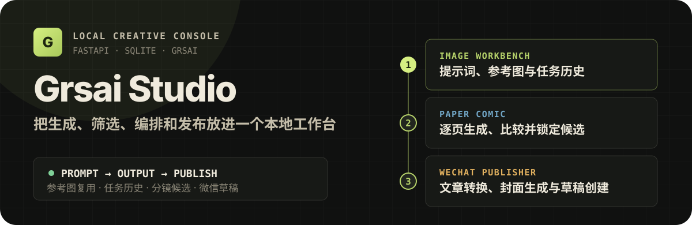
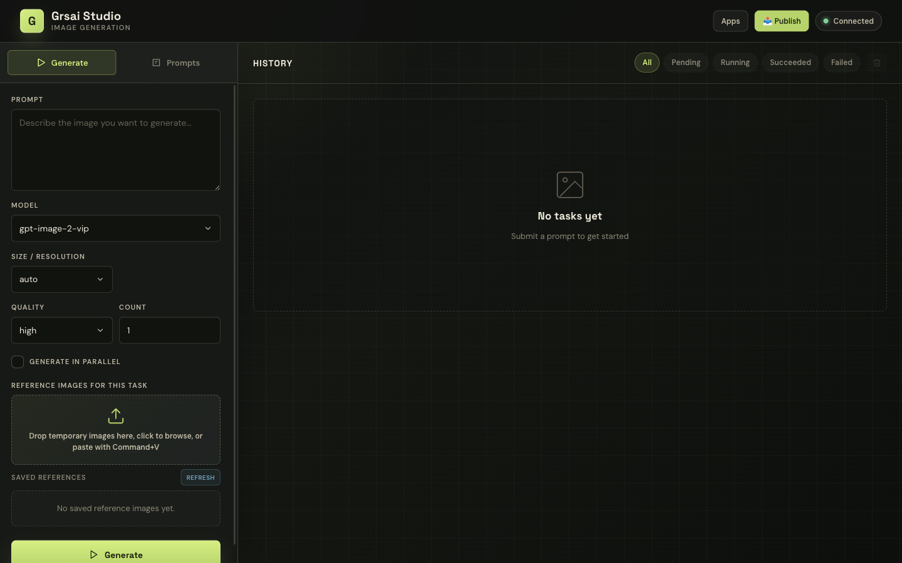
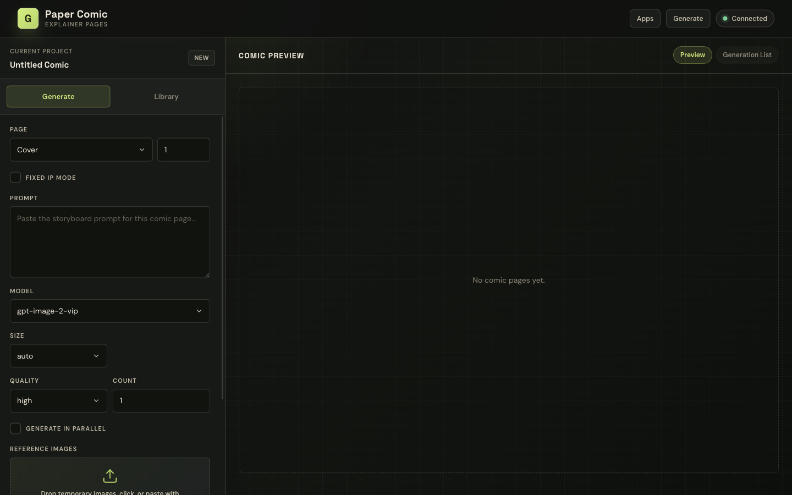
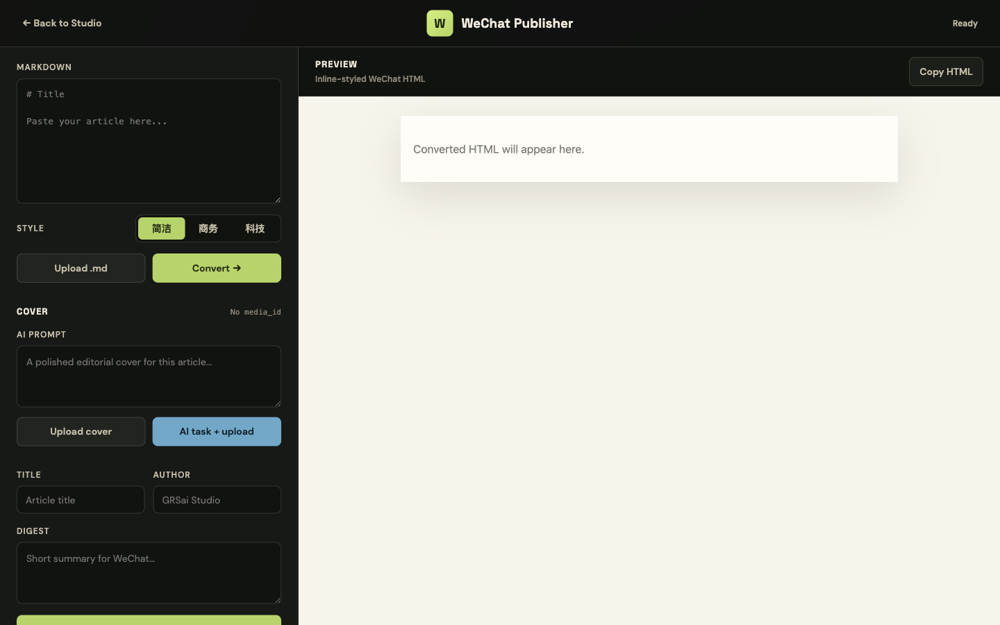

<p align="center">
  
</p>

<p align="center">
  <a href="#快速开始">快速开始</a> ·
  <a href="#三条创作工作流">工作流</a> ·
  <a href="#命令行生图">命令行</a> ·
  <a href="#开发与-api">开发与 API</a>
</p>

Grsai Studio 是面向 [Grsai 生图 API](https://grsai.com/) 的本地 Web 工作台。它把提示词、参考图、生成任务、漫画分镜候选和微信公众号草稿集中在同一个 FastAPI 应用中，适合个人创作、内容运营和批量出图调试。

> 从一次生图到一组稳定的内容资产，不必在脚本、文件夹和发布后台之间来回切换。

<p align="center">
  
</p>

## 为什么使用 Grsai Studio

| 你要完成的事 | Grsai Studio 提供的路径 |
| --- | --- |
| 快速生成和比较图片 | 配置模型、尺寸、质量和数量，串行或并行创建任务，并在历史记录中复用参数 |
| 保持角色或品牌一致 | 临时参考图随任务使用，长期参考图库可跨任务复用 |
| 制作论文解读漫画 | 按项目和页码生成多个候选，绑定 IP 参考图并选定最终版本 |
| 整理微信公众号文章 | Markdown 转微信内联 HTML，生成或上传封面，再创建公众号草稿 |
| 脱离浏览器批量出图 | 使用 `scripts/generate.sh` 调用同一套 Grsai API 与节点兜底逻辑 |

所有任务和参考图默认留在本机：SQLite 保存任务状态，文件系统保存参考图和生成结果。项目没有前端构建步骤，页面由 FastAPI 直接提供。

## 三条创作工作流

### 1. 图片工作台

访问 `http://127.0.0.1:8099/`，完成从输入到结果管理的主流程：

1. 输入 Prompt，选择模型、分辨率、质量和生成数量。
2. 拖拽、选择或粘贴临时参考图，也可以复用参考图库。
3. 串行或并行提交任务，在右侧查看等待、运行、成功和失败状态。
4. 打开 Lightbox 对比结果，下载或压缩图片；需要时一键恢复原任务参数。

支持 `nano-banana`、`nano-banana-pro` 和 `gpt-image-2` 系列模型。可用尺寸会随模型自动切换。

### 2. 漫画工作台

访问 `http://127.0.0.1:8099/comic`，以项目为单位制作多页内容：

<p align="center">
  
</p>

- 区分封面、编号页和尾页，并保存各页候选。
- 将常驻 Prompt 和 IP 参考图绑定到当前项目。
- 在候选列表中比较结果并选定最终版本。
- 从任务历史使用“同款”恢复完整生成参数。

### 3. 微信公众号发布器

访问 `http://127.0.0.1:8099/publisher`，把文章送到公众号草稿箱：

<p align="center">
  
</p>

1. 粘贴 Markdown 或上传 `.md` 文件。
2. 选择简洁、商务或科技样式，由 Gemini 转换为微信内联 HTML。
3. 上传封面，或创建 AI 封面任务并将结果上传至微信素材库。
4. 填写标题、作者和摘要，创建微信公众号草稿。
5. 到微信公众平台检查草稿后再决定是否发布。

## 快速开始

### 环境要求

- Python 3.10+
- Git
- Grsai API Key
- macOS/Linux 推荐 Bash；Windows 推荐 PowerShell，也可使用 Git Bash 或 WSL

只有公众号工作流需要额外准备微信公众号 `AppID`、`AppSecret` 和 Gemini API Key。

### 1. 获取并配置

```bash
git clone https://github.com/EricLeeK/grsai-studio.git
cd grsai-studio
cp .env.example .env
```

Windows PowerShell 使用：

```powershell
Copy-Item .env.example .env
```

编辑 `.env`，图片工作台只要求第一项：

```env
GRSAI_API_KEY=your_api_key_here

# 仅微信公众号发布器需要
WECHAT_APPID=your_appid_here
WECHAT_SECRET=your_secret_here
GEMINI_API_KEY=your_gemini_api_key_here
GEMINI_BASE_URL=https://generativelanguage.googleapis.com/v1beta
GEMINI_MODEL=gemini-2.5-flash

# 可选
# GRSAI_BASE_URL=https://grsai.dakka.com.cn
# GRSAI_OUTPUT_DIR=./output
```

不要提交 `.env`。项目已将密钥文件和本地运行数据加入 `.gitignore`。

### 2. 启动

macOS/Linux 一键启动：

```bash
bash start.sh
```

脚本会创建 `.venv`、安装依赖并启动 `http://127.0.0.1:8099`。也可以指定端口或在后台运行：

```bash
bash start.sh 9000
bash start-bg.sh
bash stop.sh
```

Windows PowerShell：

```powershell
py -m venv .venv
.\.venv\Scripts\Activate.ps1
python -m pip install -r requirements.txt
uvicorn app.main:app --host 127.0.0.1 --port 8099
```

如果 PowerShell 禁止激活虚拟环境，只为当前窗口放宽策略：

```powershell
Set-ExecutionPolicy -Scope Process -ExecutionPolicy Bypass
.\.venv\Scripts\Activate.ps1
```

### 3. 确认服务

打开 `http://127.0.0.1:8099/`，或检查健康接口：

```bash
curl http://127.0.0.1:8099/api/health
```

预期返回：

```json
{"status":"ok"}
```

## 命令行生图

不启动 Web 界面也可以直接生成图片：

```bash
bash scripts/generate.sh "a cute cat, digital art"
```

常用组合：

```bash
# Nano Banana：比例 + 分辨率
bash scripts/generate.sh \
  --model nano-banana-pro-4k-vip \
  --ratio 16:9 \
  --size 4K \
  "landscape at sunset"

# GPT Image：像素尺寸 + 质量
bash scripts/generate.sh \
  --model gpt-image-2-vip \
  --size 2048x2048 \
  --quality high \
  "abstract geometric art"

# 使用参考图
bash scripts/generate.sh \
  --ref /path/to/reference.jpg \
  "same character in a different pose"
```

脚本读取项目根目录的 `.env`。配置 `GRSAI_BASE_URL` 后会优先使用该节点，连接失败时仍会尝试内置的国内和海外节点。

```bash
bash scripts/generate.sh --help
```

## 本地数据

```text
grsai-studio/
├── data/
│   ├── grsai.db             # SQLite 任务与项目数据
│   ├── reference_images/    # 长期参考图库
│   └── task_references/     # 随任务保存的临时参考图
├── output/                  # 生成图片与发布器封面
├── logs/server.log          # 后台服务日志
└── .server.pid              # 后台服务进程号
```

这些目录不会提交到 Git。备份时如需保留历史任务和素材，请同时复制 `data/` 与 `output/`。

## 开发与 API

### 技术结构

```text
Browser (HTML / CSS / JavaScript)
              │
              ▼
FastAPI routers ── tasks / references / comic / publisher
              │
              ├── SQLAlchemy + SQLite
              ├── ThreadPoolExecutor
              └── Grsai / Gemini / WeChat APIs
```

- **后端：** FastAPI、SQLAlchemy、SQLite
- **前端：** 原生 HTML、CSS、JavaScript，无构建工具
- **任务执行：** `ThreadPoolExecutor` 后台执行生图任务
- **外部服务：** Grsai API、Gemini API、微信公众号接口

本地开发：

```bash
python3 -m venv .venv
source .venv/bin/activate
python -m pip install -r requirements.txt
uvicorn app.main:app --reload --host 127.0.0.1 --port 8099
python -m pytest -q
```

<details>
<summary><strong>HTTP API 一览</strong></summary>

| 方法 | 路径 | 说明 |
| --- | --- | --- |
| GET | `/api/health` | 健康检查 |
| POST | `/api/tasks` | 创建 JSON 生图任务 |
| POST | `/api/tasks/upload` | 创建带上传参考图的任务 |
| GET | `/api/tasks?limit=50&offset=0` | 分页查询任务 |
| GET | `/api/tasks/{task_id}` | 查询单个任务 |
| DELETE | `/api/tasks/{task_id}` | 删除任务和对应文件 |
| DELETE | `/api/tasks/failed` | 删除所有失败任务 |
| POST | `/api/tasks/images/{image_id}/compress` | 压缩生成图片 |
| GET/POST | `/api/reference-images` | 查询或上传长期参考图 |
| DELETE | `/api/reference-images/{image_id}` | 删除参考图 |
| GET | `/api/comic/projects/current` | 获取或创建当前漫画项目 |
| GET | `/api/comic/projects/{project_id}/candidates` | 查询漫画候选图 |
| GET/POST | `/api/comic/projects/{project_id}/prompts` | 查询或新增项目 Prompt |
| PATCH/DELETE | `/api/comic/prompts/{prompt_id}` | 修改或删除项目 Prompt |
| GET/PUT | `/api/comic/projects/{project_id}/ip-references` | 查询或更新 IP 参考图 |
| POST | `/api/comic/candidates/{candidate_id}/select` | 选择最终候选 |
| POST | `/api/publisher/convert` | Markdown 转微信 HTML |
| POST | `/api/publisher/upload-cover` | 上传封面至微信素材库 |
| POST | `/api/publisher/generate-cover-task` | 创建封面生成任务 |
| POST | `/api/publisher/upload-cover-from-task` | 上传已生成的封面 |
| POST | `/api/publisher/draft` | 创建微信公众号草稿 |

</details>

<details>
<summary><strong>项目目录</strong></summary>

```text
grsai-studio/
├── app/
│   ├── main.py                  # FastAPI 入口和页面路由
│   ├── config.py                # 环境变量和目录配置
│   ├── database.py              # SQLite 连接和初始化
│   ├── models.py                # SQLAlchemy 模型
│   ├── schemas.py               # Pydantic schema
│   ├── routers/                 # tasks / references / comic / publisher
│   ├── services/                # API、任务执行、压缩与内容转换
│   ├── static/                  # CSS、JavaScript 与图标
│   └── templates/               # HTML 页面
├── scripts/generate.sh          # 命令行生图脚本
├── tests/                       # 自动化测试
├── requirements.txt
├── start.sh
├── start-bg.sh
└── stop.sh
```

</details>

## 常见问题

<details>
<summary><strong>启动后打不开网页</strong></summary>

确认终端显示 `Uvicorn running on http://127.0.0.1:8099`。如果端口被占用，可以执行：

```bash
bash start.sh 9000
```

或手动指定其他端口：

```bash
uvicorn app.main:app --host 127.0.0.1 --port 9000
```

</details>

<details>
<summary><strong>提示 GRSAI_API_KEY is not configured</strong></summary>

确认项目根目录存在 `.env`，并且包含有效的 `GRSAI_API_KEY`。启动命令也需要在项目根目录执行。

</details>

<details>
<summary><strong>生成任务一直失败</strong></summary>

依次检查 API Key、`GRSAI_BASE_URL` 网络连通性、参考图大小，以及模型与尺寸组合。可以用命令行隔离测试：

```bash
bash scripts/generate.sh "simple test image"
```

</details>

<details>
<summary><strong>微信公众号草稿创建失败</strong></summary>

检查 `WECHAT_APPID`、`WECHAT_SECRET`、公众号接口权限、封面 `media_id`，以及 Gemini 转换接口是否可用。

</details>

## License

本项目当前未包含许可证文件。若计划开放复用或接受外部贡献，建议补充明确的开源许可证。
